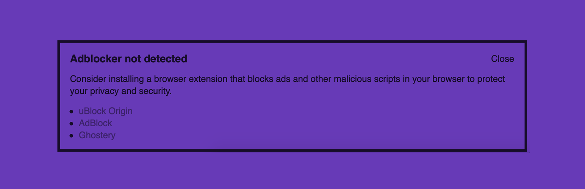

# Detect Missing Ad-blocker

Warn your website's visitors if they don't have an ad-blocking plugin installed.

[More about the project](https://stefanbohacek.com/project/detect-missing-adblocker-wordpress-plugin/)

## Development

1. Install dependencies with `npm install`.
2. Run `npm run build` to compile JS/CSS files or `npm run watch` to watch for file changes while developing.
