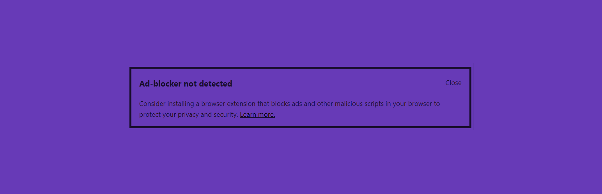

# Detect Missing Ad-blocker

## Development

1. Install dependencies with `npm install`.
2. Run `npm run build` to compile JS/CSS files or `npm run watch` to watch for file changes while developing.
